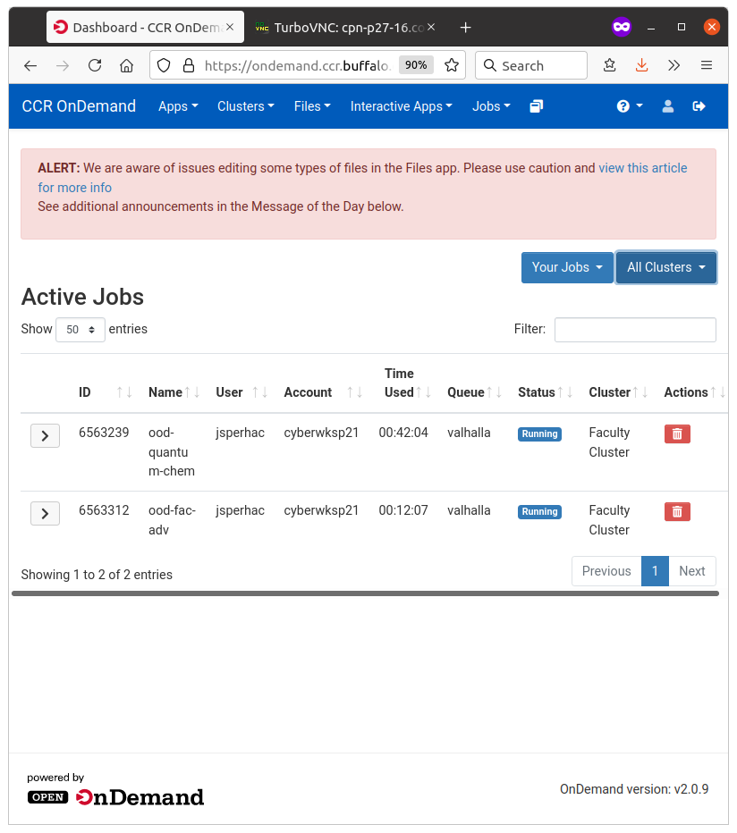
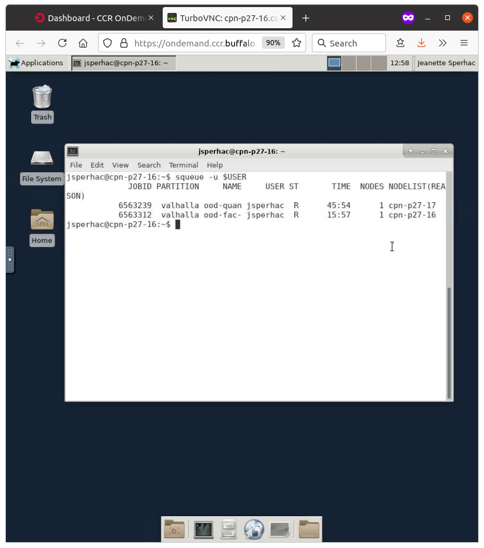
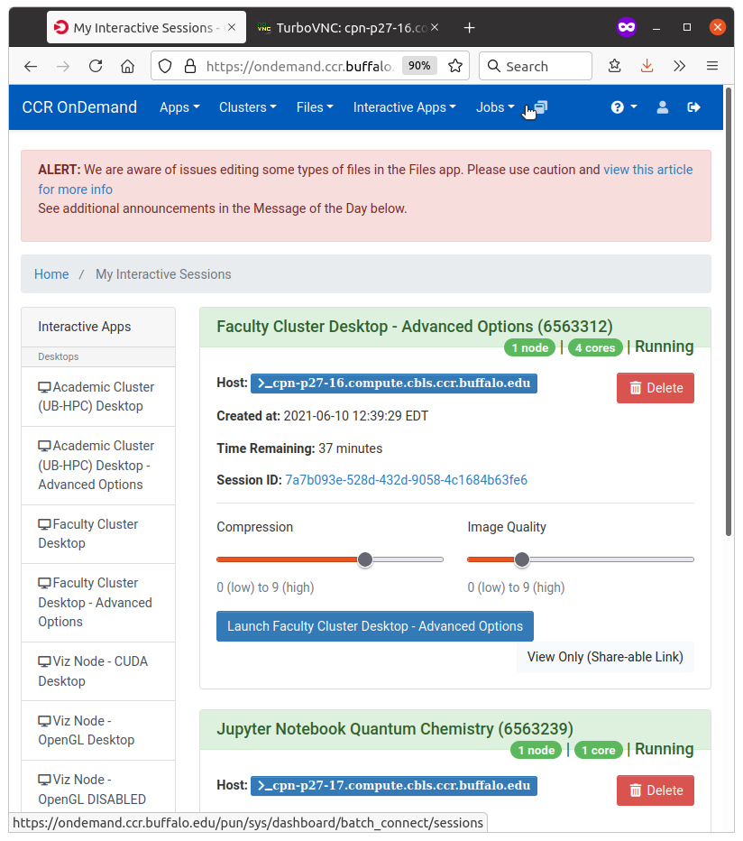
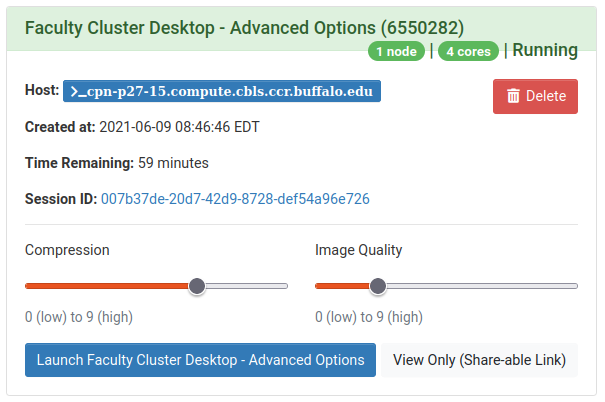

% HPC at CCR, and Intro to OnDemand
% Jeanette Sperhac
% 14 June 2021
<!-- : Cybertraining Quantum Chemistry Workshop -->
<!--- pandoc -t slidy -s slides-intro-workshop.md -o slides-intro-slidy.html -->

# Welcome to Center for Computational Research (CCR)

:::::::::::::: {.columns}
::: {.column width="40%"}
{width=100%}
:::
::: {.column width="60%"}
We are an academic research computing center at
 
University at Buffalo,

State University of New York (SUNY),

Buffalo, New York, USA.
:::
::::::::::::::

---

# High-Performance Computing (HPC) at CCR

:::::::::::::: {.columns}
::: {.column width="50%"}
{width=100%}
:::
::: {.column width="50%"}
- CCR houses about 1600 computing **nodes**
- each node has up to 40 processing **cores** (CPUs) 
- some have Graphics Processing Units (GPUs)

In total, CCR has about 30,000 CPUs (cores).
:::
::::::::::::::

----

## What makes HPC, HPC?

Overall high performance computing features:

- Fast compute
- Data storage
- Substantial memory
- Fast networking
- Specialized software

----

## Fast compute

CCR has more than 1 PFlop/second peak performance compute capacity

    petaflop/s = one quadrillion floating-point operations per second

- processor density (up to 40 cores/node)
- lots of memory (up to 800 GB/node)
- specialized hardware (think GPUs)
- specialized architectures (tuned to scientific problems)

----

## Lots of data storage

:::::::::::::: {.columns}
::: {.column width="40%"}
{width=100%}
:::
::: {.column width="60%"}
3+ PB high-performance parallel filesystem

(recall: 1 PB = 2^50 bytes = 1024 terabytes = one million gigabytes)
:::
::::::::::::::

----

## High performance networks

:::::::::::::: {.columns}
::: {.column width="40%"}
{width=100%}
:::
::: {.column width="60%"}
- fast connections to data storage
- fast interconnects between compute nodes
:::
::::::::::::::

---

<!----

## About SLURM

{width=20%}

SLURM is our batch scheduler. It's the gatekeeper on the CCR computing resource. 

You tell it what you want to run on:

- how many *cores*?
- how much *memory*?
- for what *duration*?

(Yes, the name is a Futurama reference!)

[About SLURM](https://ubccr.freshdesk.com/support/solutions/articles/5000686927)

-->

## About SLURM

:::::::::::::: {.columns}
::: {.column width="30%"}
{width=100%}

(Yes, the name is a Futurama reference!)
:::
::: {.column width="70%"}
SLURM (*Simple Linux Utility for Resource Management*) is batch scheduling software. It's the gatekeeper on the CCR computing resource. 

You tell it about your job's requirements:

- how many *cores*?
- how much *memory*?
- for what *duration*?
:::
::::::::::::::

----

## About SLURM II

:::::::::::::: {.columns}
::: {.column width="30%"}
{width=100%}

(Yes, the name is a Futurama reference!)
:::
::: {.column width="70%"}
We must also tell SLURM where to run our job:

- under whose *account*? 
- on which *cluster*? 
- on which *partition*? 

And SLURM schedules your job. 
:::
::::::::::::::

----

## CCR has three computing clusters:

- general-compute
- industry
- **faculty** (that's us!)

----

## Faculty cluster

On the faculty cluster, we will use the valhalla partition and these parameters:

    cluster=faculty

    account=cyberwksp21

    partition=valhalla

    qos=valhalla

See for yourself! On the command line, type: `slimits`

----

## Different ways to run

We can tell SLURM to run:

- `sbatch`: 

    schedule a "batch" job when possible
    
- `salloc`/`srun`: 

    schedule the resources with salloc, run interactively with srun
    
### See `salloc` and `srun` in action:    
 [salloc demo](https://asciinema.org/a/366845)

----

## Monitoring: So, what's cooking on the cluster?

What may I access on the cluster?

    slimits

Show me the faculty cluster status:

    sqstat --faculty
    
Show me valhalla's `allocated` nodes:
    
    snodes all faculty/valhalla | grep alloc
    
output:

{width=90%}

<!--[snodes documentation](https://ubccr.freshdesk.com/support/solutions/articles/13000076289-snodeshardware-details-about-cluster-nodes)-->

----

## About OnDemand at CCR

During the workshop, we will use a web browser and OnDemand to access CCR computing resources.
In some cases the negotiation with SLURM happens behind the scenes.

[https://ondemand.ccr.buffalo.edu](https://ondemand.ccr.buffalo.edu)

We will use OnDemand three ways:

- *Jupyter Notebooks*

    notebooks run on a `valhalla` compute node
    
- *Faculty Cluster App* 

    command line access to a `valhalla` compute node
    
- *Faculty Shell*

    command line access to CCR front-end node, `vortex`

----

## OnDemand at CCR

This is where we begin: `https://ondemand.ccr.buffalo.edu`

{width=70%}
    

<!-- 
## Making columns
:::::::::::::: {.columns}
::: {.column width="40%"}
contents...
:::
::: {.column width="60%"}
contents...
:::
::::::::::::::

-->

---

<!---
## OnDemand Jupyter Notebooks

Schedule a SLURM job that runs a Jupyter session on a `valhalla` compute node:

    Interactive Apps -> Jupyter Notebook Quantum Chemistry

:::::::::::::: {.columns}
::: {.column width="33%"}
1. Start the Interactive App:

{width=100%}
:::
::: {.column width="33%"}
2. Configure the session (Specify SLURM parameters):

{width=90%}

:::
::: {.column width="33%"}
3. Run Jupyter: 

{width=100%}
:::
::::::::::::::

--->

## OnDemand Jupyter Notebooks

Schedule a SLURM job that runs a Jupyter session on a `valhalla` compute node:

    Interactive Apps -> Jupyter Notebook Quantum Chemistry

:::::::::::::: {.columns}
::: {.column width="33%"}
1. Start the Interactive App:

:::
::: {.column width="33%"}
<!-- 2. Configure the session (Specify SLURM parameters):

{width=90%} -->

:::
::: {.column width="33%"}
<!-- 3. Run Jupyter: 

{width=100%} -->
:::
::::::::::::::

{width=70%}

---

## OnDemand Jupyter Notebooks

Schedule a SLURM job that runs a Jupyter session on a `valhalla` compute node:

    Interactive Apps -> Jupyter Notebook Quantum Chemistry

:::::::::::::: {.columns}
::: {.column width="33%"}
<!-- 1. Start the Interactive App: -->

:::
::: {.column width="33%"}
2. Configure the session (Specify SLURM parameters):

:::
::: {.column width="33%"}
<!-- 3. Run Jupyter: 

{width=100%} -->
:::
::::::::::::::

{width=70%}

---

## OnDemand Jupyter Notebooks

Schedule a SLURM job that runs a Jupyter session on a `valhalla` compute node:

    Interactive Apps -> Jupyter Notebook Quantum Chemistry

:::::::::::::: {.columns}
::: {.column width="33%"}
<!-- 1. Start the Interactive App: -->

:::
::: {.column width="33%"}
<!-- 2. Configure the session (Specify SLURM parameters):-->

:::
::: {.column width="33%"}
3. Run Jupyter: 
:::
::::::::::::::

{width=70%}

---

<!--
## OnDemand Faculty Cluster App

Schedule a SLURM job that runs a Linux desktop on a `valhalla` compute node: 

    Interactive Apps -> Faculty Cluster Desktop - Advanced Options

*Share the cores!*

:::::::::::::: {.columns}
::: {.column width="33%"}
1. Start the Interactive App:

{width=100%}
:::
::: {.column width="33%"}
2. Specify SLURM parameters:

{width=100%}

:::
::: {.column width="33%"}
3. Run Cluster Desktop: 

{width=100%}
:::
::::::::::::::

-->

## OnDemand Faculty Cluster App

Schedule a SLURM job that runs a Linux desktop on a `valhalla` compute node: 

    Interactive Apps -> Faculty Cluster Desktop - Advanced Options

*Share the cores!*
    
:::::::::::::: {.columns}
::: {.column width="33%"}
1. Start the Interactive App:

:::
::: {.column width="33%"}
<!-- 2. Specify SLURM parameters:

{width=100%} -->

:::
::: {.column width="33%"}
<!--3. Run Cluster Desktop: 

{width=100%} -->
:::
::::::::::::::

{width=70%}

---

## OnDemand Faculty Cluster App

Schedule a SLURM job that runs a Linux desktop on a `valhalla` compute node: 

    Interactive Apps -> Faculty Cluster Desktop - Advanced Options

*Share the cores!*
    
:::::::::::::: {.columns}
::: {.column width="33%"}
<!--1. Start the Interactive App: -->

:::
::: {.column width="33%"}
2. Specify SLURM parameters:

:::
::: {.column width="33%"}
<!--3. Run Cluster Desktop: 

{width=100%} -->
:::
::::::::::::::

{width=70%}

---

## OnDemand Faculty Cluster App

Schedule a SLURM job that runs a Linux desktop on a `valhalla` compute node: 

    Interactive Apps -> Faculty Cluster Desktop - Advanced Options

*Share the cores!*
    
:::::::::::::: {.columns}
::: {.column width="33%"}
<!--1. Start the Interactive App: -->

:::
::: {.column width="33%"}
<!-- 2. Specify SLURM parameters: -->

:::
::: {.column width="33%"}
3. Run Cluster Desktop: 

:::
::::::::::::::

{width=70%}

---

## OnDemand Faculty Shell

Run a command line shell on CCR's front-end node, `vortex`:

    Clusters -> Faculty Cluster Shell Access
    
Note: It's not a running job, just a shell. Use the shell to run a SLURM script, or a modest test (few minutes' duration, low memory requirements).
    
:::::::::::::: {.columns}
::: {.column width="50%"}
1. Start the shell:

{width=100%}
:::
::: {.column width="50%"}
2. Run the shell: 

{width=100%}
:::
::::::::::::::

<!-- [Faculty Shell Docs](https://ubccr.freshdesk.com/support/solutions/articles/13000072839-ondemand-cluster-app) -->

----

## View your active jobs

View jobs you are running right now:

    Jobs -> Active Jobs
:::::::::::::: {.columns}
::: {.column width="50%"}
1. View in OnDemand:

{width=100%}
:::
::: {.column width="50%"}
2. Or run `squeue -u $USER` in a terminal: 

{width=100%}
:::
::::::::::::::

---

## Troubleshoot and debug

View your OnDemand sessions (Click on the box icon, `My Interactive Sessions`):

{width=60%}

---

## Troubleshoot and debug: zoom in on one session

For each session we see useful information:

- Note the hostname where the job is running, `cpn-p27-15`

- You can click `Session ID` to access session log files

{width=50%}

---

## Files app

:::::::::::::: {.columns}
::: {.column width="60%"}
{width=100%}
:::
::: {.column width="40%"}
Use the OnDemand Files app (e.g. `Files -> Home Directory`) for:

- Browsing directories
- Upload files
- Download files
- Simple file edits\*
:::
::::::::::::::

\* Potentially

---

## Editing your files

You have multiple options for file editor:

- OnDemand Files app\* (simplest)
- `nano` (easy)
- `vi` (just right)
- `emacs` (grrr)

\* Potentially

---

## Contact us

Have a question, comment, or issue?

- Join us on the workshop Slack channel:
 
    quantumdynamicshub.slack.com
    
- Check the [CCR documentation](TODO)

- Enter a CCR help ticket:

   email: `ccr-help@buffalo.edu`

   webpage: [https://ubccr.freshdesk.com/](https://ubccr.freshdesk.com/support/home)

