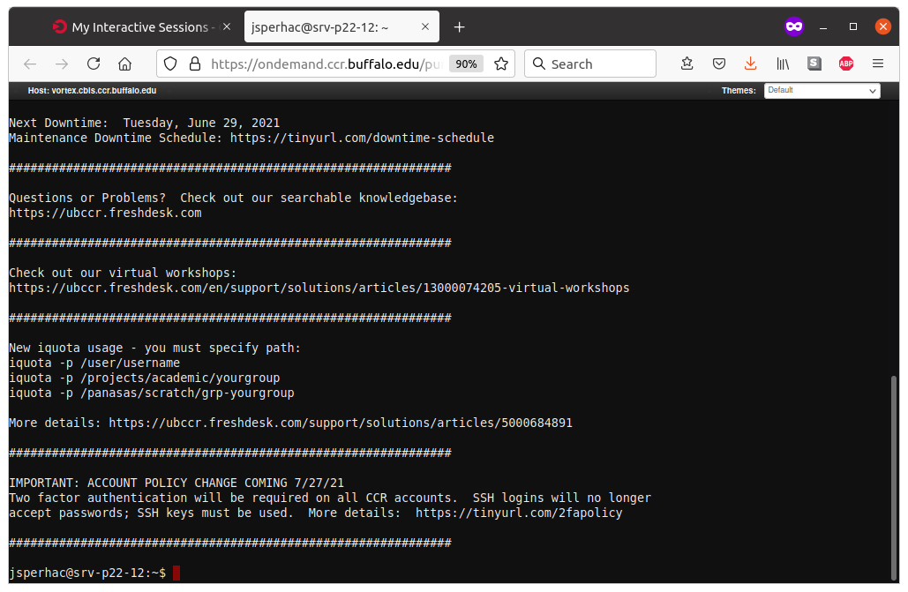

% Workshop setup at CCR
% Jeanette Sperhac
% 14 June 2021

## Workshop checklist

Before the workshop begins, please ensure that you have followed emailed instructions from CCR to do
the following:

- installed the UB VPN software on your own computer
- signed into the UB VPN software
- logged on to CCR and changed your CCR password
- verified your access to OnDemand at CCR

## Quick Setup at CCR

This quick setup will prepare your account, settings, and directories for the workshop.

We will walk through these steps together during the workshop introduction session. Please carry them out in your own account!

Any problems, issues, or questions, please Slack or raise your hand.

## Sign on

1. Connect to UB VPN (use your VPN password)

1. Sign in to OnDemand (use your CCR password): [https://ondemand.ccr.buffalo.edu](https://ondemand.ccr.buffalo.edu).

1. In the OnDemand window, click `Clusters -> Faculty Cluster Shell Access` to open a shell, as shown:

   {width="80%"}

---

## First time OnDemand access

You'll see a terminal as shown below. Use it to run this command:

    /util/ccr/bin/ssh_no_password.sh

This ensures you can ssh between any nodes in the cluster. Keep your terminal open!
    
{width="70%"}
    
---

## Link to project space

Next, in your terminal, create a link from your home directory to the project space by typing the following:

    ln -s /projects/academic/cyberwksp21 ~/workshop
    
Check this by typing:

    ls -l workshop
    
You should see something like this--a successful link to our project space:

{width="80%"}

---

## Create your project and scratch subdirectories

We now verify/create directories for your use during the workshop. These directories will have your own CCR username.

Verify your Student directory by typing:

    ls /projects/academic/cyberwksp21/Students/ | grep $USER
    
...you will see your own username returned from this command.

Create your scratch directory by typing:

    mkdir -p /panasas/scratch/grp-cyberwksp21/$USER

---

## `.bashrc` edits

   We now make two simple additions to your .bashrc file. 
   You can use nano or vim editors for this task. We will demonstrate with nano.

   From your home directory, type:

     nano .bashrc

   Use the arrow keys to move the cursor in nano.
   Add the following two lines to your .bashrc file:

    module use /projects/academic/cyberwksp21/Modules
    export SLURM_CONF=/util/ccr/slurm/slurm-faculty.conf

   Click ctrl-S to save, then ctrl-X to exit the nano editor. Then:

    source .bashrc

### Verify

    module avail
    
The first output returned should look like:

   {width="80%"}
   
---

## Congratulations

You're ready for the workshop!

(Now let's do something cool)
